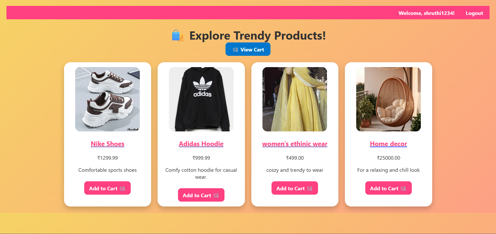
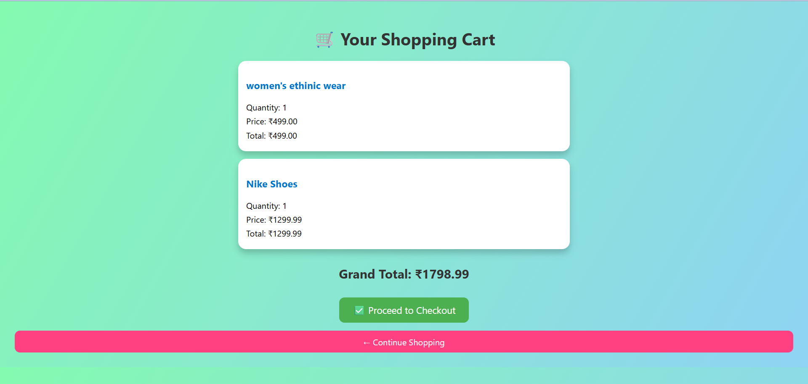

# 🛒 Django E-Commerce Store

A simple e-commerce web application built with **Django**.  
Users can browse products, add them to a cart, register/login, and place orders.

---

## 🚀 Features
- User registration & login
- Product listings
- Product details page
- Shopping cart
- Order processing
- Admin panel to manage products & orders

---

## 🛠 Tech Stack
- **Backend:** Django (Python)
- **Frontend:** HTML, CSS, JavaScript
- **Database:** SQLite (default, can change to PostgreSQL/MySQL)
- **Authentication:** Django built-in auth system

---

## ⚙️ Installation & Setup

1. Clone the repository:
   ```bash
   git clone https://github.com/Vaibhavasri2005/codealpha_ecommercestore.git
   cd codealpha_ecommercestore
# 🛍️ CodeAlpha E-commerce Store

A simple e-commerce website built with Django.

---

## 📸 Screenshots

### 🏠 Home Page


### 🛍 Product Listing


### 🛒 Cart Page

